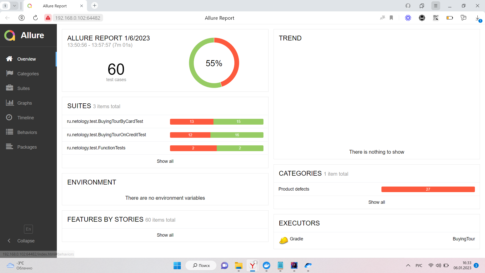

Отчет о проведенном тестировании 
---
## 1.Краткое описание ##
В процессе автоматизации тестирования были реализованы позитивные и негативные сценарии заполнения тестовой страницы. Реализована поддержка СУБД: 
1. MySQL
2. PostgreSQL

### Были протестированы сценарии: ###

1. Успешная оплата тура и покупка тура в кредит
2. Отказ банка при оплате тура и покупке тура в кредит
3. Проверка заполнения формы невалидными данными
4. Проверка записи данных в БД при использовании MySQL, PostgreSQL

[Перечень выявленных ошибок.](https://github.com/Varek1807/Diplom/issues)

## 2.Количество тест-кейсов. Процент успешных и неуспешных тест-кейсов ##
Общее количество тест-кейсов - 60, успешныхшных - 55%, неуспешных - 45%.

Ниже приведен отчет Allure:

Результаты прогона тестов не зависят от типа подключенной БД, поэтому представлен единый отчёт по тестам.

## 3.Общие рекомендации ##
1. Разработать качественную техническую документацию по проекту
